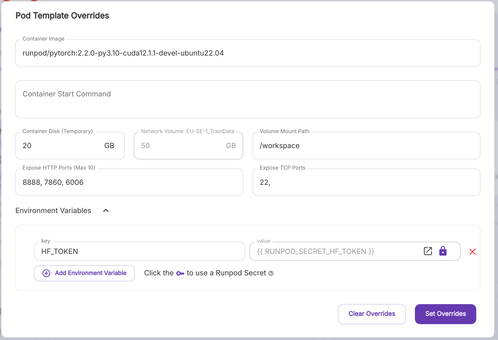
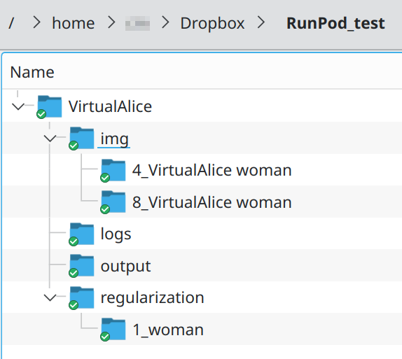

# Run kohya-ss on RunPod

This description should help you how to get quickly kohya-ss running on the RunPod GPU
to start training finetunes or LoRA for Flux.1

The script is running Flux.1[dev], so it's license applies to your generated models.
To use Flux.1[schnell] instead you can easily modify the script yourself.

## Initial setup

As downloading Flux.1[dev] requires a HF_TOKEN this is the first step that you must do:

1. Create a https://huggingface.co/ account and generate a token
2. In the runpod.io manager create a new secret, name it "HF_TOKEN" and set the
   token as its value
   
3. Now it is also a good time to set your publish SSH key to RunPod so that you can
   connect with `ssh` to the mache once it is running.

   When you don't know what that means: with SSH you can connect to the terminal
   of the server. Don't be afraid of it, the relevant commands are given here.
   But what's not given here is how you get your local SSH key, please look it up
   yourself, there are many free ressources about how to use SSH in the internet.
5. Create a new pod of type
   
   > RunPod Pytorch 2.1
   > 
   > runpod/pytorch:2.1.0-py3.10-cuda11.8.0-devel-ubuntu22.04
   
   and go to "Edit Template" to give it at least 40 GB temporary and 50 GB persistant memory.
   Also add the "Environment Variable" with the key `HF_TOKEN` that uses as value the secret
   (click on the key icon and select "HF_TOKEN"):
   

Now you would be ready to run it but to be more efficient and don't waste money you should 
prepare the data to train right now.

## Data preparation

That means you should organize the images, the captions and the regularization images in exactly
the same way as kohya-ss is expecting them. You can then later upload that with any means that 
RunPod allows. But when you are on a slow upload like me you might want to circumvent that.
For this I just use Dropbox. In the shared Dropbox directory on my machine I set up the data
as required, waited until is was (slowly) synced and then got from Dropbox a link to publish
this share.



The Dropbox link to the directory `PunPod_test` from my example could look something like
`https://www.dropbox.com/scl/fo/ix7lumksw49w5ljlm68jb/ALQq7qPJyapoczVNDUSe9vHk?rlkey=h5rnnp2zt04zr32mnus4u5quv&dl=0`
and please take notice how it's ending with `&dl=0`. When this is replaced by `&dl=1` the
directory will be downloaded in one ZIP file.

## Runing the cloud server

Up to this point everything was free, but as soon as you are starting your cloud GPU server
you must pay money for every minute it is running. This is most likely still cheaper than
buying your own hardware but it is important to remember that this is causing costs now
so that you stop and delete the machine as soon as you don't require it anymore.

At RunPod you are now clicking on the "Deploy On-Demand" of the pod that you had configured
in the first step. When your balance isn't sufficient RunPod will tell you so that you
can charge it first.

Once you have started it, it takes a short time to set itself up. Once it is ready you
can click on "Connect" to see the options about how to connect to this machine.
As written above I'm using the SSH connection for that.

Once you have the SSH connection running please follow with these steps:

1. Run these commands (copy & paste from there is fine) - **but make sure** that the
   Dropbox link is exactly that one that you got from Dropbox but with the
   exchanged `&dl=1`:

   ```
   apt-get update
   apt-get install unzip
   cd /workspace
   wget --show-progress  'https://www.dropbox.com/scl/fo/ix7lumksw49w5ljlm68jb/ALQq7qPJyapoczVNDUSe9vHk?rlkey=h5rnnp2zt04zr32mnus4u5quv&dl=1' -O import_data.zip
   unzip import_data.zip
   wget https://raw.githubusercontent.com/StableLlama/kohya_on_RunPod/main/setup.sh -O setup.sh
   ```

   Now you just need to call
   ```
   /workspace/setup.sh
   ```
   and you are ready to go.
2. When you stoped the Pod and are restarting it again it is sufficient to just call
   ```
   /workspace/setup.sh
   ```
   to get going.   
3. Once kohya-ss is running you can go to the RunPod page at "Connect" and click on
   the "Connect to HTTP Service 7860" and the kohya-ss GUI opens up in your browser

## Using kohya-ss

You can use it as you are used to. All the training data is in directories like
`/workspace/VirtualAlice/img`.

The models to train on are located at:
```
/workspace/models/ae.safetensors
/workspace/models/clip_l.safetensors
/workspace/models/t5xxl_fp16.safetensors
/workspace/models/flux1-dev.safetensors
```
